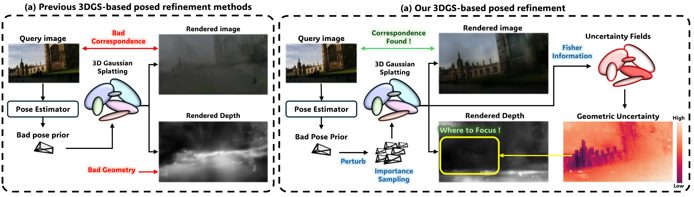

<h1 align="center">Rethinking Pose Refinement in 3D Gaussian Splatting under Pose Prior and Geometric Uncertainty</h1>
<p align="center"><strong><span style="font-size:1.1em;">CVPR 2026</span></strong></p>
<div align="center">
  <a href="https://arxiv.org/abs/2603.16538"></a> &nbsp;
  <a href="https://kmk97.github.io/UGSLoc/"></a>
</div>
<p align="center">
  
</p>

**[Mangyu Kong](https://kmk97.github.io/), [Jaewon Lee](https://scholar.google.com/), [Seongwon Lee](https://scholar.google.com/), [Euntai Kim](https://scholar.google.com/)**  

## Overview

This repository releases the **UGSLoc** particle-filter localization pipeline: scaffold-Gaussian rendering, MASt3R-based correspondence pose refinement (CPR), geometric uncertainty weighting, and importance-weighted robust estimation. All core code lives under `ugsLoc/`.


## Installation

We tested our code with **CUDA 11.7**, **PyTorch 2.0.1**, and **Python 3.10+** on Linux with an NVIDIA GPU.

### Clone this repo

```bash
git clone <repo-url> UGSLoc
cd UGSLoc
git submodule update --init --recursive
```

### Install dependencies for Scaffold-GS rendering

```bash
conda create -n ugsloc python=3.10
conda activate ugsloc
conda install pytorch torchvision pytorch-cuda=11.7 -c pytorch -c nvidia

cd ugsLoc
pip install -r requirements.txt

# CUDA extensions
cd diff && pip install -e .
cd ../submodules/diff-gaussian-rasterization && pip install -e .
cd ../../diff-gaussian-rasterization-depth && pip install -e .
cd ../submodules/simple-knn && pip install -e .
```

### Pretrained Gaussian maps, uncertainty fields, and appearance models

This repo contains **code and coarse pose priors only**. Pretrained assets will be released separately (project page / Google Drive — link TBD).

Download and place them following the layout below:

```
/path/to/data/
├── cambridge/
│   ├── KingsCollege/
│   ├── ShopFacade/
│   ├── OldHospital/
│   └── StMarysChurch/
└── 7scenes/
    ├── scene_chess/train/output/
    ├── scene_fire/train/output/
    └── ...
```

Each Gaussian map directory should contain:

```
{gaussian_model}/
  point_cloud/iteration_30000/point_cloud.ply
  color_mlp.pt / cov_mlp.pt / opacity_mlp.pt   # scaffold MLPs
  hessian_color_semantic.pt                     # Cambridge (or hessian_color2.pt for 7-Scenes)
```

For Cambridge appearance color correction, download ACT/NeRF weights and set `--ft_path`:

```
/path/to/appearance_models/
  KingsCollege/
  ShopFacade/
  ...
```

Coarse pose priors for multiple estimators are **included** in this repo:

```
ugsLoc/coarse_poses/{dfnet,ace,mspt,marepo,glace}/
  Cambridge/poses_Cambridge_{Scene}_.txt
  7Scenes_pgt/poses_pgt_7scenes_{scene}_.txt
```

Paper defaults use `--pose_estimator dfnet`.

### Install dependencies for UGSLoc localization (MASt3R)

MASt3R and DUSt3R are bundled under `ugsLoc/mast3r/` and `ugsLoc/dust3r/`. Install additional Python deps as needed (same environment as above):

```bash
conda activate ugsloc
cd ugsLoc
pip install pytorch-msssim scipy
# MASt3R weights are fetched automatically from Hugging Face on first run
```

## Datasets (raw images + poses + intrinsics)

This paper evaluates on two public datasets (same splits / formats as [GS-CPR](https://github.com/XRIM-Lab/GS-CPR)):

- [Microsoft 7-Scenes](https://www.microsoft.com/en-us/research/project/rgb-d-dataset-7-scenes/)
- [Cambridge Landmarks](https://www.repository.cam.ac.uk/handle/1810/251342/)

Following [ACE](https://github.com/nianticlabs/ace) / [GS-CPR](https://github.com/XRIM-Lab/GS-CPR), you can use the dataset setup scripts in the GS-CPR `datasets/` folder to download and extract data in a consistent format.

> **Important: make sure you have checked the license terms of each dataset before using it.**

### 7-Scenes

Use PGT (pseudo ground truth) poses as in GS-CPR:


Expected paths for localization:

```
-s /path/to/pgt_7scenes_chess/test
-m /path/to/scene_chess/train/output
```

Test split layout:

```
pgt_7scenes_chess/test/
  images/
  pose/
  calibration/
```

Scenes: `chess`, `fire`, `heads`, `office`, `pumpkin`, `redkitchen`, `stairs`.

### Cambridge Landmarks


For Cambridge, `-s` and `-m` typically point to the **same scene root**:

```
/path/to/KingsCollege/
  processed/                  # images (test split)
  sparse/0/                   # COLMAP cameras.bin, images.bin
  dataset_test.txt
  point_cloud/iteration_30000/
  hessian_color_semantic.pt
```

Scenes used in paper eval: `KingsCollege`, `ShopFacade`, `OldHospital`, `StMarysChurch`.

## UGSLoc Localization Evaluation

Paper-style hyperparameters are built into `CambridgeLocParams` / `SevenScenesLocParams` in `ugsLoc/arguments/__init__.py`. Shell scripts only pass `-s`, `-m`, and `--scene_name`.

### Cambridge Landmarks

```bash
export SCENE_ROOT=/path/to/scene
bash scripts/run_cambridge_localization.sh
```

Or run a single scene:

```bash
cd ugsLoc
python loc.py --dataset cambridge \
  -s /path/to/scene/KingsCollege \
  -m /path/to/scene/KingsCollege \
  --scene_name KingsCollege
```

### 7-Scenes

```bash
export SCENE_ROOT=/path/to/scene
export GAUSSIAN_ROOT=/path/to/gaussian_model
bash scripts/run_7scenes_localization.sh
```

Or run a single scene:

```bash
cd ugsLoc
python loc.py --dataset 7scenes \
  -s /path/to/pgt_7scenes_chess/test \
  -m /path/to/scene_chess/train/output \
  --scene_name chess
```

Optional flags (see `python loc.py --help`):

| Flag | Description |
|------|-------------|
| `--pose_estimator` | Coarse pose source: `dfnet` (default), `ace`, `mspt`, ... |
| `--no_appearance` | Disable appearance color transform (Cambridge) |
| `--test_cams_index` | Subset of test camera indices (7-Scenes) |
| `--ft_path` | Path to appearance NeRF weights (Cambridge) |

Results (per-camera errors, success rates) are saved under `ugsLoc/outputs/{output_dir}/`.

## Repository Layout

| Path | Role |
|------|------|
| `ugsLoc/loc.py` | Localization entry (`--dataset cambridge` or `7scenes`) |
| `ugsLoc/cpr.py` / `cpr_unc.py` | CPR pose refinement (standard / uncertainty-weighted) |
| `ugsLoc/unc_render.py` | Uncertainty map rendering |
| `ugsLoc/loc_utils.py` | Particles, metrics, I/O |
| `ugsLoc/coarse_poses/` | Precomputed coarse poses |
| `scripts/` | Batch eval helpers |

## Citation

If you find our work helpful, please consider citing:

```bibtex
@article{kong2026ugsLoc,
  title={Rethinking Pose Refinement in 3D Gaussian Splatting under Pose Prior and Geometric Uncertainty},
  author={Kong, Mangyu and Lee, Jaewon and Lee, Seongwon and Kim, Euntai},
  journal={arXiv preprint arXiv:2603.16538},
  year={2026}
}
```

## Acknowledgements

This project builds on [GS-CPR](https://github.com/XRIM-Lab/GS-CPR), [Scaffold-GS](https://github.com/city-super/Scaffold-GS), [MASt3R](https://github.com/naver/mast3r), [DUSt3R](https://github.com/naver/dust3r), [3D Gaussian Splatting](https://github.com/graphdeco-inria/gaussian-splatting), [ACE](https://github.com/nianticlabs/ace), and [Depth for 3DGS](https://github.com/leo-frank/diff-gaussian-rasterization-depth). We thank the original authors for their excellent work.

## License

See `LICENSE.md`. Third-party submodules retain their original licenses.
